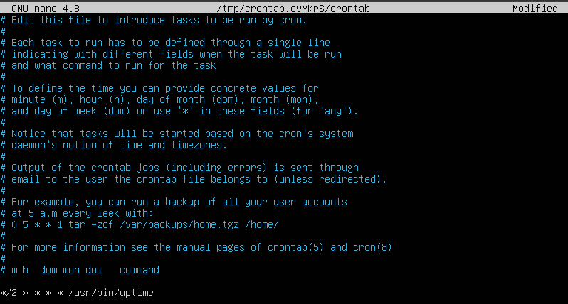

Оглавление:

[[_TOC_]]

## Part №1. Установка ОС
```
Установить Ubuntu 20.04 Server LTS без графического интерфейса. (Используем программу для виртуализации - VirtualBox)
```

1. Заходим на [сайт](https://linuxconfig.org/how-to-install-ubuntu-20-04-on-virtualbox).
2. Следуя гайду, создаем виртуальную машину в VirtualBox.
3. Загружаем образ _Ubuntu 20.04 Server LTS_ с [официального сайта](http://releases.ubuntu.com/20.04/).
4. Запускаем нашу виртуальную машину.
5. Подключаем скаченный _iso_-файл.
6. Настраиваем параметры установки, которые появляются на экране.
7. Заходим нв нашего пользователя.
8. Проверяем установленную версию.


_Вывод команды cat /etc/issue_

## Part №2. Создание пользователя
```
Создать пользователя, отличного от пользователя, который создавался при установке. Пользователь должен быть добавлен в группу _adm_.
```
1. Чтобы создать нового пользователя, используем команду sudo adduser _new\_username_.


_Вывод команды sudo adduser new\_username_


2. Чтобы назначить права администратора новому пользователю, добавим его в группу _adm_. Выполним команду _sudo usermod -aG adm new\_username_.
3. Проверяем наличие пользователя.


_Вывод команды cat /etc/passwd_


## Part №3. Настройка сети ОС
```
Задать название машины вида user-1
Установить временную зону, соответствующую вашему текущему местоположению.
Вывести названия сетевых интерфейсов с помощью консольной команды.
```

1. Задаем название машины с помощью команды _sudo hostnamectl set-hostname user-1_.
2. Проверяем имя машины.


_Вывод команды hostname_


3. Для установки временной зоны посмотрим список доступных зон, которые можно установить, с помощью команды _timedatectl list-timezones_.
4. Находим в списке строку _Europe/Moscow_.
5. Воспользуемся командой _sudo timedatectl set-timezone Europe/Moscow_ для установки временной зоны.
6. Проверяем текущую временную зону.


_Вывод команды timedatectl_


7. Получаем названия сетевых интерфейсов с помощью консольной команды.


_Вывод команды ip link show_


На данном скриншоте мы видим интерфейс _lo_.

Интерфейс _lo_ представляет собой специальный сетевой интерфейс в системах _Linux_, известный как "петлевой" (_loopback_) интерфейс. Он предназначен для обратной связи на устройстве и используется для тестирования и взаимодействия с локальными приложениями, работающими на той же машине (локально).

Когда ваше устройство отправляет данные на интерфейс _lo_, они не покидают машину, а направляются обратно к себе. Таким образом, любые данные, отправленные на этот интерфейс, обрабатываются только локально, и сетевое взаимодействие не требуется.

Основное назначение интерфейса _lo_:

- Тестирование сетевых приложений: Множество сетевых программ, таких как веб-серверы, базы данных и другие, могут быть протестированы на локальной машине, используя интерфейс _lo_, без риска взаимодействия с внешними сетями.

- Самодиагностика: Когда вы используете _IP_-адрес _127.0.0.1_ (также известный как _localhost_) для взаимодействия с интерфейсом _lo_, вы можете проверить работу сетевых служб и приложений, не выходя в интернет.

Интерфейс _lo_ является важной частью сетевой инфраструктуры _Linux_ и позволяет легко взаимодействовать с локальными приложениями и тестировать сетевые службы на одной машине.


```
Используя консольную команду получить ip адрес устройства, на котором вы работаете, от DHCP сервера.
```

8. Получаем ip адрес устройства от DHCP сервера


_Вывод команды dhclient -v enp0s3_


ДНС (DHCP) расшифровывается как "Протокол динамической конфигурации хоста" (англ. "Dynamic Host Configuration Protocol"). Это сетевой протокол, используемый для автоматической настройки сетевых параметров устройствам, подключенным к сети. DHCP позволяет компьютерам, смартфонам, планшетам и другим устройствам автоматически получать IP-адрес, маску подсети, шлюз по умолчанию и адреса DNS-серверов без необходимости вручную настраивать эти параметры.

```
Определить и вывести на экран внешний ip-адрес шлюза (ip) и внутренний IP-адрес шлюза, он же ip-адрес по умолчанию (gw).
Задать статичные (заданные вручную, а не полученные от DHCP сервера) настройки ip, gw, dns (использовать публичный DNS серверы, например 1.1.1.1 или 8.8.8.8).
Перезагрузить виртуальную машину. Убедиться, что статичные сетевые настройки (ip, gw, dns) соответствуют заданным в предыдущем пункте.
```

9. Определим внешний ip-адрес шлюза.


_Вывод команды dig +short myip.opendns.com @resolver1.opendns.com_


10. Определим внутренний ip-адрес шлюза.


_Вывод команды ip route | grep default_


11. Откроем файл конфигурации сетевых интерфейсов для редактирования _/etc/netplan/00-installer-config.yaml_ с помощью nano.
12. В файле конфигурации добавим необходимую информацию.


_Файл /etc/netplan/00-installer-config.yaml, открытый с помощью редактора nano_


13. Применяем настройки сети, используя команду _sudo netplan apply_.
14. Перезагружаем виртуальную машину.
15. Проверяем настройки сети.


_Вывод команд ip a | grep "enp0s3" ; ip route show | grep default ; systemd-resolve --status | grep "DNS Servers"_


16. Пропингуем удаленный хост _1.1.1.1_.


_Вывод команды ping 1.1.1.1_


17. Пропингуем удаленный хост _ya.ru_.


_Вывод команды ping ya.ru_


## Part №4. Обновление ОС
```
Обновить системные пакеты до последней на момент выполнения задания версии.
```

1. Обновляеем информацию о доступных пакетах из репозиториев, чтобы убедиться, что мы работаем с актуальными данными о версиях пакетов.


_Вывод команды sudo apt update_


2. Обновляем систему с помощью команды _sudo apt upgrade_.
3. Проверяем, что нет больше пакетов для установки.


_Вывод команды sudo apt upgrade_


## Part №5. Использование команды sudo
```
Разрешить пользователю, созданному в Part 2, выполнять команду sudo.
```

Команда _sudo_ (от англ. _"Superuser Do"_) - это утилита в системах _Linux_ и других _Unix_-подобных операционных системах, которая позволяет выполнять команды с правами суперпользователя _(root)_ или других пользователей с повышенными привилегиями.


Назначение команды _sudo_:


- Получение прав суперпользователя: Основное назначение команды _sudo_ - предоставить временный доступ к выполнению команд с привилегиями суперпользователя. Это позволяет обычным пользователям выполнять определенные задачи, которые требуют привилегий администратора, без необходимости входить в систему под учетной записью суперпользователя.


- Выполнение системных задач: Команды, требующие доступа к системным ресурсам и конфигурациям, часто могут быть выполнены только с правами суперпользователя. _sudo_ позволяет пользователям выполнять такие задачи, такие как установка и обновление программ, изменение системных настроек, администрирование сети и другие операции, которые обычным пользователям недоступны.


- Улучшение безопасности: Использование _sudo_ позволяет ограничивать доступ к системным ресурсам и операциям, что способствует повышению безопасности. Вместо того чтобы всегда работать под учетной записью суперпользователя, пользователи могут выполнять команды с повышенными привилегиями только по мере необходимости, минимизируя риски ошибок и случайного повреждения системы.


- Аудит и журналирование: Команда _sudo_ записывает выполненные команды в журнал, что позволяет вести аудит и отслеживать действия пользователей с повышенными привилегиями. Это может быть полезно для отслеживания и анализа действий администраторов системы.


Команда _sudo_ часто используется администраторами и опытными пользователями для управления системой и выполнения задач, требующих повышенных привилегий. Однако следует использовать ее с осторожностью, чтобы избежать случайных или небезопасных операций, которые могут повредить систему.

1. Дадим пользователю, которого мы создали в "Part 2" _n_ возможность использовать команду _sudo_ с помощью команды _sudo usermod -aG sudo n_
2. Перезагружаем виртуальную машину с помощью команды _reboot_.
3. Перейдем на пользователя _n_.
4. Задаем название машины с помощью команды _sudo hostnamectl set-hostname user-2_.
5. Проверяем имя машины.


_Вывод команды hostname_


## Part №6. Установка и настройка службы времени
```
Настроить службу автоматической синхронизации времени.
```

1. Посмотрим время часового пояса, в котом я сейчас нахожусь.


_Текущее время в Москве_


2. Проверим время на виртуальной машине.


_Вывод команды timedatectl show_


## Part №7. Установка и использование текстовых редакторов
```
Установить текстовые редакторы VIM (+ любые два по желанию NANO, MCEDIT, JOE и т.д.)
Используя каждый из трех выбранных редакторов, создайте файл test_X.txt, где X -- название редактора, в котором создан файл. Напишите в нём свой никнейм, закройте файл с сохранением изменений.
```

1. Устанавливаем редакторы _vim, nano, mcedit_ с помощью команды _sudo apt install имя\_редактора_.
2. _VIM_

    2.1. Для создания и редактирования файла в _vim_ напишем команду _vim test_vim.txt_.

    2.2. В открывшемся редакторе нажимамаем клавишу _i_ для того чтобы перейти в режим вставки (_insert_).

    2.3. В режиме вставки пишем слово _maganand_.

    2.4. Для выхода из режима вставки и перехода в командный режим нажимаем клавишу _Esc_.
    
    2.5. Вводим команду _:wq_ для выхода с сохранением (_write + quit_).

    

    _Редактор vim перед закрытием_


3. _NANO_

    3.1. Для создания и редактирования файла в _nano_ напишем команду _nano test_nano.txt_.

    3.2. В открывшемся редакторе пишем слово _maganand_.

    3.3. Нажимаем комбиназию клавиш _Ctrl+O_ для сохранения изменений.

    3.4. Внизу появится текст с названием файла, т.к. название нет необходимости менять просто нажимаем клавишу _Enter_.

    3.5. Нажимаем комбинацию _Ctrl+X_ для выхода из _nano_.

    

    _Редактор nano перед закрытием_


4. _MCEDIT_

    4.1. Для создания и редактирования файла в _mcedit_ напишем команду _mcedit test_mcedit.txt_.

    4.2. В открывшемся редакторе пишем слово _maganand_.

    4.3. Нажимаем клавишу _F10_ для выхода с сохранением.

    4.4. Подтверждаем наше действие выбрав 'Да' в открывшемся окне.

    

    _Редактор mcedit перед закрытием_


```
Используя каждый из трех выбранных редакторов, откройте файл на редактирование, отредактируйте файл, заменив никнейм на строку "21 School 21", закройте файл без сохранения изменений.
```

5. _VIM_

    5.1. Для редактирования файла пишем команду _vim test_vim.txt_.

    5.2. В открывшемся редакторе нажимамаем клавишу _i_ для того чтобы перейти в режим вставки (_insert_).

    5.3. В режиме вставки меняем слово _maganand_ на _21 School 21_.

    5.4. Для выхода из режима вставки и перехода в командный режим нажимаем клавишу _Esc_.
    
    5.5. Вводим команду _:q!_ для выхода без сохранения (_quit_), и обхода предупреждений.

    

    _Редактор vim после редактирования_


6. _NANO_
    
    6.1. Для редактирования файла в _nano_ напишем команду _nano test_nano.txt_.

    6.2. В открывшемся редакторе заменим слово _maganand_ на _21 School 21_.

    6.3. Нажимаем комбинацию _Ctrl+X_ для выхода из _nano_.

    6.4. На предложение сохранить изменениия нажимаем клавишу _N_ (_No_).

    

    _Редактор nano после редактирования_


7. _MCEDIT_

    7.1. Для редактирования файла в _mcedit_ напишем команду _mcedit test_mcedit.txt_.

    7.2. В открывшемся редакторе меняем слово _maganand_ на _21 School 21_.

    7.3. Нажимаем клавишу _F10_ для выхода без сохранения.

    7.4. Отказываемся от сохранения выбрав 'Нет' в открывшемся окне.

    

    _Редактор mcedit после редактирования_


```
Используя каждый из трех выбранных редакторов, отредактируйте файл ещё раз (по аналогии с предыдущим пунктом), а затем освойте функции поиска по содержимому файла (слово) и замены слова на любое другое.
```

8. _VIM_

    8.1. Для редактирования файла пишем команду _vim test_vim.txt_.

    8.2. В открывшемся редакторе нажимамаем клавишу _i_ для того чтобы перейти в режим вставки (_insert_).

    8.3. В режиме вставки добавляем слово _hello_ перед _maganand_.

    8.4. Для выхода из режима вставки и перехода в командный режим нажимаем клавишу _Esc_.

    8.5. Пишем команду _/hello_ для поиска слова и перехода к нему.

    

    _Результат запуска команды /hello в vim_

    
    8.6. Пишем команду _:%s/hello/goodbye/g_ для замены слова _hello_ на _goodbye_ (% - обозначает, что замена будет выполнена во всем файле; s - означает "заменить"; hello - это слово, которое нужно заменить; goodbye - это слово, на которое нужно заменить; g - означает "глобальную" замену, которая заменит все вхождения слова "hello" в строке).

    

    _Результат замены командой :%s/hello/goodbye/g в vim_


    8.7. Вводим команду _:wq_ для выхода с сохранением (_write + quit_).


9. _NANO_

    9.1. Для редактирования файла в _nano_ напишем команду _nano test_nano.txt_.

    9.2. В открывшемся редакторе допишем слово _hello_ перед _maganand_.

    9.3. Нажимаем комбинацию _Ctrl+\_ для открытия меню поиска.

    9.4. Вводим слово _hello_ для поиска.

    9.5. Сразу же можно ввести слово _goodbye_ для замены.

    

    _Результат поиска слова hello в nano_


    9.6. Подтверждаем операцию нажав _Y_ (_Yes_).

    

    _Замена слова hello на goodbye в nano_


    9.7. Нажимаем комбинацию _Ctrl+X_ для выхода из _nano_.

    9.8. На предложение сохранить изменениия нажимаем клавишу _Y_ (_Yes_).

    9.9. Поскольку нам не надо менять название файла в котором мы производим изменения просто наэимаем клавишу _Enter_.


10. _MCEDIT_

    10.1. Для редактирования файла в _mcedit_ напишем команду _mcedit test_mcedit.txt_.

    10.2. В открывшемся редакторе добавляем слово _hello_ перед _maganand_.

    10.3. Нажимаем клавишу _F7_ для поиска слова.

    10.4. В открывшемся меню вводим строку _hello_ и нажимаем _Enter_.

    

    _Результат поиска слова hello в mcedit_


    10.5. Открываем меню поиска и замены с помощью _F4_.

    10.6. Вводим слово _hello_ для поиска и _goodbye_ для замены.

    

    _Замена слова hello на goodbye в mcedit_


    10.7. Подтвержаем наше действие нажав клавишу _Заменить_ в открывшемся меню.

    10.8. Нажимаем клавишу _F10_ для выхода с сохраненем.

    10.9. Подтвержаем сохранение в открывшемся окне выбрав _Да_.


## Part №8. Установка и базовая настройка сервиса SSHD
```
Установить службу SSHd.
Добавить автостарт службы при загрузке системы.
Перенастроить службу SSHd на порт 2022.
Используя команду ps, показать наличие процесса sshd. Для этого к команде нужно подобрать ключи.
```

1. Для того чтобы установить службу _SShd_ выполним команду _sudo apt install openssh-server_.
2.Чтобы добавить автостарт службы при загрузке системы, сначала необходимо узнать имя связанного с ней файла-юнита. Для этого выполним команду _sudo systemctl status sshd_, и найдем строчку _loaded ..._. Там и будет находится необходимый нам файл (...).
3. Непосредственно добавляем службу в автостарт: _sudo systemctl enable ..._.
4. Для того чтобы настроить службу на порт 2022, откроем файл конфигурации в _nano_: _sudo nano /etc/ssh/sshd_config_.
5. Найдем строку _#Port 22_ и изменим ее на _Port 2022_.


_Файл концигурации в редакторе nano_


6. После внесения изменений, перезапустим службу _SSHd_, чтобы применить новый порт: _sudo systemctl restart sshd_.
7. Для того чтобы показать наличие процесса _sshd_ выполнима команду _ps -C sshd -o pid,cmd_, где _-C sshd_ позволяет отобразить только процессы с именем команды _sshd_, _-o pid,cmd_ задает формат вывода, чтобы показать только идентификаторы процессов (PID) и команды запуска процесса (CMD).


_Результат запуска команды ps -C sshd -o pid,cmd_


```
Перезагрузить систему.
```

8. Перезагружаем систему командой _reboot_.
9. Выполним загрузку необходимых команд: _sudo apt install net-tools_.
10. Выполним команду _netstat -tan_.


_Результат запуска команды netstat -tan_


Команда netstat (network statistics) предоставляет информацию о состоянии сетевых подключений и сетевых статистиках в Linux. Когда команда netstat используется с опциями -tan, она показывает список всех активных сетевых соединений (TCP и UDP) на машине, а также отображает числовые значения портов и IP-адресов. Вот расшифровка опций netstat -tan:

-t: Отображает информацию только о TCP-соединениях.

-a: Показывает все сетевые соединения, включая активные и прослушивающие (listening) порты.

-n: Выводит числовые значения IP-адресов и портов вместо их разрешенных имен.


Вот значения каждого столбца вывода:

- Proto: Протокол сетевого соединения. В данном случае, это TCP (Transmission Control Protocol), так как мы используем опцию -t, чтобы отобразить только TCP-соединения.

- Recv-Q и Send-Q: Количество байт данных, ожидающих чтения (Recv-Q) и отправки (Send-Q) в буферах сокетов. Обычно эти значения равны нулю или очень малы, если соединение не перегружено.

- Local Address: Локальный адрес и порт, на котором работает процесс или служба. В формате IP:порт. 0.0.0.0 означает, что служба прослушивает на всех доступных IP-адресах.

- Foreign Address: Внешний адрес и порт, с которого идет или куда направляется соединение. В формате IP:порт. Если соединение является входящим (например, к серверу), здесь будет указан IP и порт источника. Если соединение является исходящим (например, от сервера к клиенту), здесь будет указан IP и порт назначения.

- State: Состояние TCP-соединения. Здесь отображается текущее состояние соединения. Некоторые распространенные состояния включают LISTEN (слушание, когда сервер ожидает входящих подключений), ESTABLISHED (установлено активное TCP-соединение), TIME_WAIT (соединение закрыто и ждет окончания всех пакетов), и т.д.


## Part №9. Установка и использование утилит top, htop
```
Установить и запустить утилиты top и htop.
```

1. Установим утилиты. В моей ОС они уже были по умолчанию, но если это не так, можно воспользоваться командой _sudo apt install_.
2. После запуска этих утилит мы сможем увидеть системную статистику. Для этого можнео воспользоваться командами _top_ и _htop_.
3. По выводу _top_ определим:
    - _Uptime_. 12:10:28.
    - Количество авторизированных пользователей. 1.
    - Общую загрузку системы. 0.03, 0.03, 0.00.
    - Общее количество процессов. 120.
    - Загрузку cpu. 0,0 us, 0,0 sys, 0,0 ni, 100,0 id, 0,0 wa, 0,0 hi, 0,0 si, 0,0 st.
    - Загрузку памяти. 7945,3 total, 7287,6 free, 175,6 used, 482,1 buff/cache.
    - Pid процесса, занимающего больше всего памяти. 720.
    - Pid процесса, занимающего больше всего процессорного времени. 605.


4. _htop_

    4.1. Сортировка по _PID, PERCENT/_CPU, PERCENT/_MEM, TIME_.

    

    _Утилита htop. Сортировка по PID_


    

    _Утилита htop. Сортировка по PERCENT\_CPU_


    

    _Утилита htop. Сортировка по PERCENT\_MEM_


    

    _Утилита htop. Сортировка по TIME_


    4.2. Фильтр для процесса _sshd_.

    

    _Утилита htop. Фильтр по sshd_


    4.3. Найти процесс _syslog_.

    

    _Утилита htop. Процесс syslog_


    4.4. Вывод _hostname, clock, uptime_.

    

    _Утилита htop. Hostname, clock, uptime_


## Part №10. Использование утилиты fdisk
```
Запустить команду fdisk -l.
```

1. Выполним команду _fdisk -l_.


_Результат запуска команды fdisk -l_


- Название жесткого диска: VBOX HARDDISK.
- Размер: 25.0 Гб.
- Кол-во секторов: 52428800.
- Размер _swap_: 0.0 B.


## Part №11. Использование утилиты df
```
Запустить команду df.
```

1. Выполним команду _df_.


_Результат запуска команды df. Выделен корневой каталог. Размер указан в Кб_


```
Запустить команду df -Th.
```

2. Выполним команду _df -Th_.


_Результат запуска команды df - Th. Выделен корневой каталог_


## Part №12. Использование утилиты du
```
Запустить команду du.
Вывести размер папок /home, /var, /var/log (в байтах, в человекочитаемом виде)
Вывести размер всего содержимого в /var/log (не общее, а каждого вложенного элемента, используя *)
```

1. Используем команду _du -s -B1 /home_ для вывода размера папки _/home_ в байтах.


_Результат запуска команды du -s -B1 /home_


2. Используем команду _du -sh /home_ для вывода размера папки _/home_ в человекочитаемом виде.


_Результат запуска команды du -sh /home_


3. Используем команду _du -s -B1 /var_ для вывода размера папки _/var_ в байтах.


_Результат запуска команды du -s -B1 /var_


4. Используем команду _du -sh /var_ для вывода размера папки _/var_ в человекочитаемом виде.


_Результат запуска команды du -sh /var_


5. Используем команду _du -s -B1 /var/log_ для вывода размера папки _/var/log_ в байтах.


_Результат запуска команды du -s -B1 /var/log_


6. Используем команду _du -sh /var/log_ для вывода размера папки _/var/log_ в человекочитаемом виде.


_Результат запуска команды du -sh /var/log_


7. Используем команду _du -h /var/log/*_ для вывода разметров содержимого папки _/var/log_ в человекочитаемом виде.


_Результат запуска команды du -h /var/log.*_


## Part №13. Установка и использование утилиты ncdu
```
Установить утилиту ncdu.
Вывести размер папок /home, /var, /var/log.
```

1. Установим утилиту _ncdu_ с помощью команды _sudo apt install ncdu_.
2. Для того чтобы определить размер папок _/home, /var_ отсканируем каталог _/_ с помощью _ncdu_.


_Результат запуска команды ncdu /_


3. Для того чтобы определить размер паки _/var/log_ отсканируем каталог _/var_ с помощью _ncdu_.


_Результат запуска команды ncdu /var_


## Part №14. Работа с системными журналами
```
Открыть для просмотра:
1. /var/log/dmesg
2. /var/log/syslog
3. /var/log/auth.log
```

_/var/log/dmesg_ содержит информацию о буфере ядра. 

_/var/log/syslog_ регистрирует все, кроме сообщений, связанных с аутентификацией.

_/var/log/auth.log_ управляет сообщениями, связанными с аутентификацией.


1. Для того чтобы определить время последней успешной авторизации, имя пользователя и метод входа в систему просмотрим файл _/var/log/auth.log_.


_Файл /var/log/auth.log, открытый в редакторе nano_


2. Перезапутим службу _sshd_ с помощью команды _systemctl restart sshd_.
3. Найдем сообщение об этом в файле _/var/log/syslog_.


_Файл /var/log/syslog, открытый в редакторе nano_


## Part №15. Использование планировщика заданий CRON
```
Используя планировщик заданий, запустите команду uptime через каждые 2 минуты.
```

1. Добавим новую задачу с помощью команды _crontab -e_.
2. Выберем редактор (_nano_).
3. Добавим строку описывающую команду.



_Планировщик заданий, открытый в редакторе nano_


4. Сохраним файл и выйдем из редактора.
5. Выводим список заданий для _CRON_.


_Результат выполнения команды crontab -l_


6. Проверяем работает ли наше задание.


_Содержимое файла /var/log/syslog_


```
Удалите все задания из планировщика заданий.
```

7. Удаляем задания с помощью команды _crontab -r_.
8. Выводим список заданий для _CRON_.


_Результат выполнения команды crontab -l_
